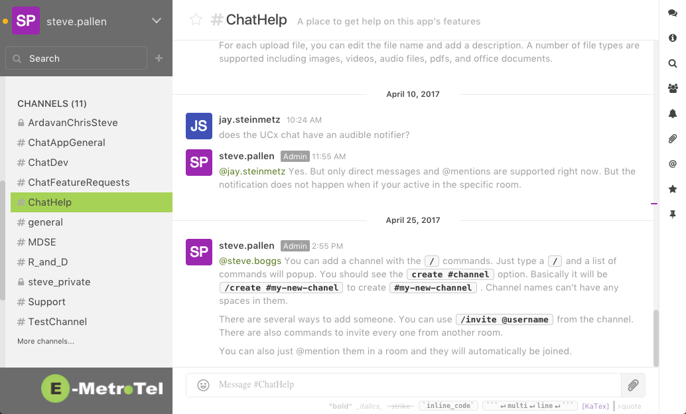
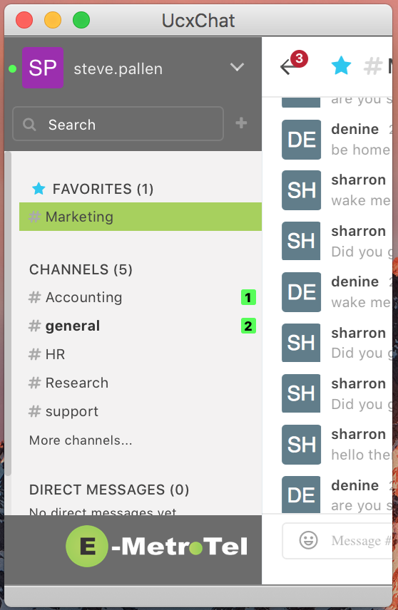
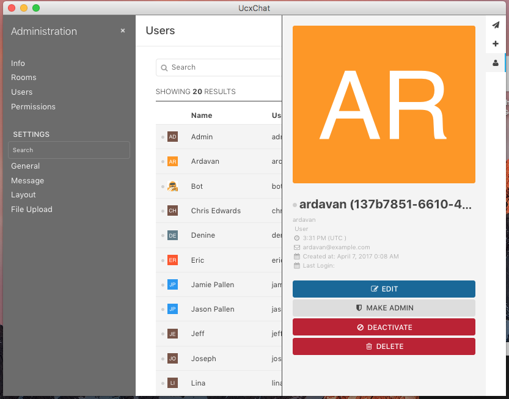
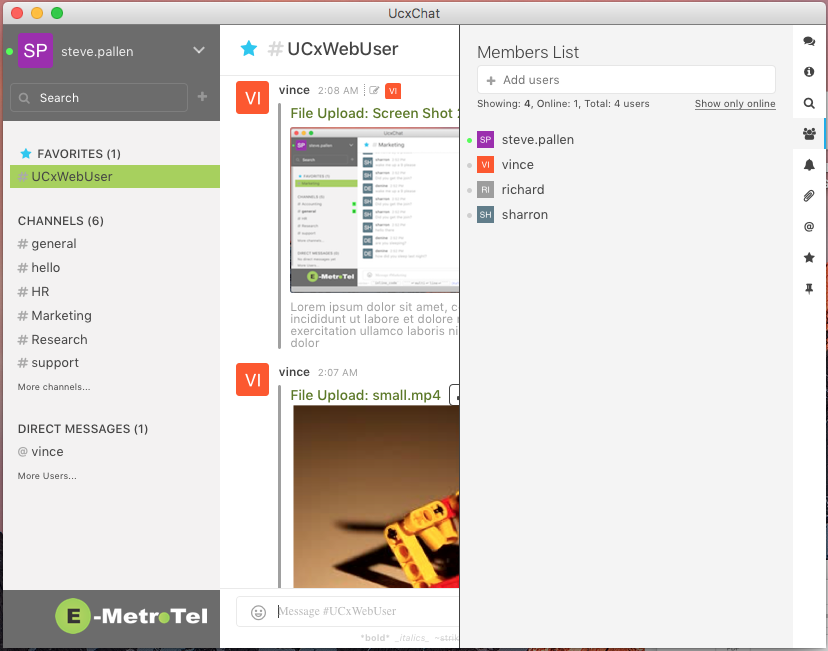

# UcxUcc - A Team Collaboration Suite

> <center><b>NOTE</b></center>
>
> This is a pre-release verson of this project. The project is being refactored and renamed. Once we get the new project working with feature parity, this project will be removed. 
>
> Your welcome to submit issues against this project until the new project is posted. However, please don't submit PRs. Development on this project has ended.

UcxUcc is a simple but powerful team collaboration suite of applications designed to improve communications, information sharing and productivity for the businesses small and large.

Checkout the [Live Demo](http://chat.spallen.com). Click on the [Register a new account](http://chat.spallen.com/registrations/new) link on the sign in page to create an account.



This innovative suite of tools enhances business productivity with:
* An enterprise class telephone that is available anywhere your employees have an Internet connection
* Share important messaging conversations that would normally be hidden in point to point conversations with tools like SMS and Skype.
* Choose the most effect method of communications a glance at their on-line or on the phone presence.
* Upload, search and download documents, images, videos, and audio files in chat rooms and share with the rest of your team.
* Start a private conversations with direct messages
* Pin important messages for quick access for everyone
* Star important messages for your quick reference
* Track popularity of messages with message reactions and see who reacted
* Never miss an important message with an advanced notification framework that provides audible, desktop, SMS, and email notifications. Control the noise by customizing the notifications on a room by room basis.

And the bast part is that the data is safe with encrypted connections between your browser and the server. All the data is stored on your own server, not on someone else's cloud.



## Available Features

* Multiple channel types (public, private, direct messgaes)
* Favorite channels
* @mentions with audible and badge notifications
* Presence with override
* Message editing, pinning, starring, deleting
* About 30 slash commands (create room, invite user, ...)
* Autolink and preview urls
* Drag and drop file update with image and video preview
* Emoji support with picker
* Message reactions
* Unread message handling
* Customizable Role and Permission system
* Some basic Bot experimental support
* Code syntax highlighting
* Profile editing and admin pages
* Very configurable
* and more ...
## Feature Roadmap

* Replace the Rock.Chat UI with a new original design
* Peer to peer Video
* Peer to peer Audio
* Presence adapters for on-the-phone presence with Asterisk PBX
* Mobile clients and Push notifications
* Email and SMS notifications
* OTR Conversations
* Live chat feature
* 3rd party integration (web hooks, Rest API)
  * BitBucket
  * Github
  * Jira
  * ...
* OAuth and LDAP
* XMPP Integration
* Internatization (Much of the UI uses gettext already)
* UI theming
* Documenation for other databases and flavours of *nix
* and more ...



## Archtectural Notes

* Elixir & Phoenix Backend
* Light JS frontend (jQuery only)
* After initial page load, channels are used for UI rendering. HTML is renedered on the server and pushed to the client over channel
* Originally build as a stand-a-lone single app.
* In the process of refactoring it to be extensible through plugins
* We will be using it for a client framework with initial support for the chat app and our commerical WebRTC softphone (delerved as a plugin)
* This is a work in progress and requires a lot of clean up before production release
* I've experiemented with serveral diffent approaches of channel -> JS rendering, channel message routing, etc. I still need to pick an approach and refactor the other areas for consistency. 



## Other Notes
### Backup Database

```bash
mysqldump --add-drop-database --add-drop-table -u user --password=secret --databases ucx_chat_prod > ucx_chat.sql
```

### Restore Database

```bash
mysql -u user -psecret < ucx_chat.sql
```

### Install Dependencies

#### ffmpeg

```bash
rpm --import http://li.nux.ro/download/nux/RPM-GPG-KEY-nux.ro
rpm -Uvh http://li.nux.ro/download/nux/dextop/el6/x86_64/nux-dextop-release-0-2.el6.nux.noarch.rpm
yum install ffmpeg ffmpeg-devel -y
```
#### ImageMagick

```bash
yum install -y ImageMagick ImageMagick-devel
```

### Running Migrations on Dev

```
iex> Ecto.Migrator.run UcxChat.Repo, Path.join([Application.app_dir(:ucx_chat) | ~w(priv repo migrations)]), :up, all: true
```

### Updating Config When there are new entires

```elixir
alias UcxChat.{Repo, Config.FileUpload, Config}
config = Repo.all(Config) |> hd
Config.changeset(config, %{file_upload: %FileUpload{} |> Map.from_struct}) |> Repo.update
```
## Contributing

We appreciate any contribution to UcxChat. Check our [CODE_OF_CONDUCT.md](CODE_OF_CONDUCT.md) and [CONTRIBUTING.md](CONTRIBUTING.md) guides for more information. We usually keep a list of features and bugs [in the issue tracker][1].

  [1]: https://github.com/smpallen99/ucx_chat/issues
## Acknowlegemets

The UI for this version of the project is taken (with some modifications) directly from [Rocket.Chat](https://rocket.chat/).
## License

`UcxChat` is Copyright (c) 2017 E-MetroTel

The source code is released under the MIT License.

Check [LICENSE](LICENSE) for more information.